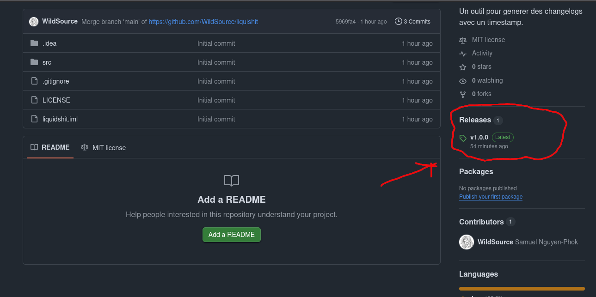

# Liquishit
Un outil en ligne de commande pour generer des changelogs pour Liquibase.

## Installation
1. Telecharger le jar dans la section release

2. Mettre le jar dans la racine du projet

## Utilisation
Pour executer l'outil.
``
java -jar liquishit.jar auteur nom_de_la_migration
``

*En execution sans arguments un guide sera printe dans le standard output*

